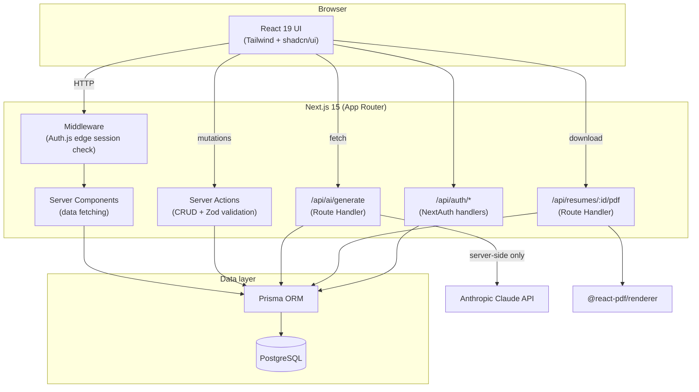
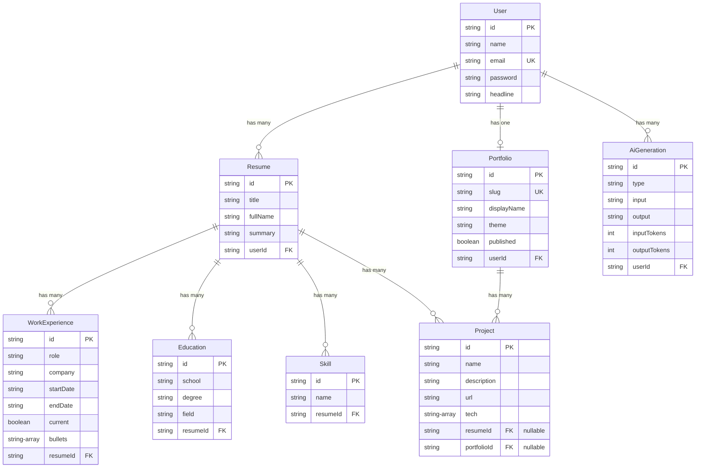

# Architecture

## System overview

Key decisions:

- **Server Actions** handle all CRUD mutations with Zod validation and ownership checks (`userId` scoping on every query).
- **Route Handlers** are used where a non-RSC response is needed: AI generation (JSON) and PDF export (binary stream).
- **Auth.js (NextAuth v5)** uses JWT sessions. The middleware consumes an edge-safe config (no Prisma import); the Credentials provider with bcrypt lives only in the Node.js runtime.
- **The Anthropic API key never reaches the client.** All Claude calls happen in `/api/ai/generate`, and every call is logged as an `AiGeneration` row with token usage.
- **Public portfolio pages** (`/p/[slug]`) are server-rendered and unauthenticated, gated only by the `published` flag.

## Entity-relationship diagram

